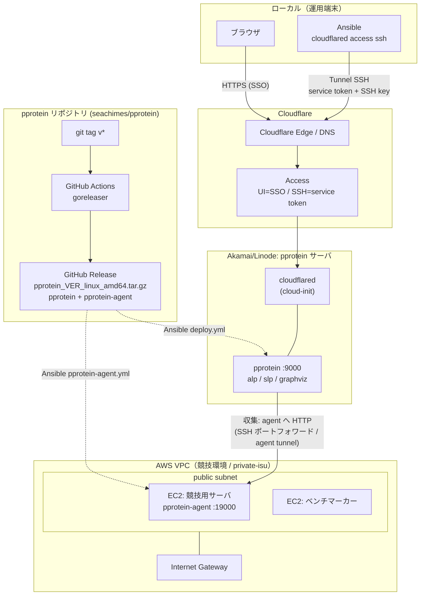

# 計測基盤の全体像（pprotein）

リリース戦略と、pprotein サーバ・エージェント・EC2・VPC の関係をまとめる。
個別の導入手順は [pprotein-server.md](pprotein-server.md) / [measurement-tools.md](measurement-tools.md) を参照。

## リリース戦略

配布元はフォークの [`seachimes/pprotein`](https://github.com/seachimes/pprotein)。

```
git tag v1.2.5 && git push origin v1.2.5
        │  (.github/workflows/publish-release.yml: tags v*)
        ▼
GitHub Actions → goreleaser
        │
        ▼
GitHub Release
  pprotein_1.2.5_linux_amd64.tar.gz   ← pprotein + pprotein-agent を同梱
  （darwin/arm64 なども同時に生成）
```

- タグ `v*` の push で GitHub Actions が goreleaser を実行し、**単一アーカイブに
  `pprotein` と `pprotein-agent` の両方**を同梱して Release に添付する。
- サーバは `pprotein`、競技用サーバは `pprotein-agent` と、**同じ Release を使う**。
- checksum は無効。Ansible は**バージョン付きの一時パス**で冪等性を担保する。
- バージョンは Ansible 変数 `pprotein_ver`（サーバ: `pprotein-server/vars.yml`、
  エージェント: `measurement/pprotein-agent.yml`）で固定する。

## 全体図



### テキスト版

```
[pprotein repo]  git tag v* ──> GitHub Actions (goreleaser) ──> GitHub Release
                                                              pprotein_<ver>_linux_amd64.tar.gz
                                                              (pprotein + pprotein-agent)
                                                                   │
                      ┌────────────────────────────────────────────┴───────────────┐
                      │ Ansible deploy.yml                                         │ Ansible pprotein-agent.yml
                      ▼                                                            ▼
        ┌─────────────────────────────┐       収集(HTTP)        ┌───────────────────────────────────┐
        │ Akamai/Linode               │  SSH port-forward /     │ AWS VPC (public subnet)           │
        │  pprotein サーバ            │  agent tunnel           │  ┌───────────────┐ ┌────────────┐ │
        │   pprotein :9000            │ ──────────────────────> │  │ EC2 app       │ │ EC2 bench  │ │
        │   alp / slp / graphviz      │                         │  │ pprotein-agent│ │            │ │
        │   cloudflared (cloud-init)  │                         │  │  :19000       │ │            │ │
        └──────────────┬──────────────┘                         │  └───────────────┘ └────────────┘ │
                       │                                        │        Internet Gateway           │
                       │                                        └───────────────────────────────────┘
                       │
              Cloudflare Edge / Access
                       │
        ┌──────────────┴───────────────┐
        │ ブラウザ (SSO)               │  ローカル Ansible (Tunnel SSH: service token + SSH key)
        └──────────────────────────────┘
```

## サーバ / エージェントの役割

| コンポーネント | ホスト | ポート | 役割 | 導入 |
| --- | --- | --- | --- | --- |
| pprotein（サーバ） | Linode（Akamai） | 9000 | UI + 収集サーバ。alp/slp/graphviz で解析 | `pprotein-server/deploy.yml` |
| cloudflared（サーバ） | Linode | — | Tunnel で UI/SSH を公開 | cloud-init（`pprotein-infra`） |
| pprotein-agent | EC2（競技用サーバ） | 19000 | nginx/MySQL ログ・pprof を提供 | `measurement/pprotein-agent.yml` |
| ベンチマーカー | EC2 | — | 負荷生成（計測対象外） | private-isu provisioning |

- エージェントは競技用サーバに**同居**し、ログファイルを読むため `root` で動く。
- サーバ側の `alp` / `slp` / `graphviz` は**サーバ側**で実行する（agent には不要）。

## EC2 / VPC（競技環境）

競技環境は CloudFormation（private-isu `provisioning/cf.yaml`）で構築する。

- `VPC` + `public subnet` + `Internet Gateway` + `RouteTable`（0.0.0.0/0 → IGW）
- `ServerInstance`（競技用サーバ = エージェント同居）と `BenchmarkerInstance` の2台
- それぞれ `EIP`（固定グローバル IP）と `SecurityGroup`

pprotein サーバは別クラウド（Linode）にあるため、エージェントへの収集経路が必要。

- **SSH ポートフォワーディング**（現行の想定）: サーバから競技用サーバへトンネルを張り、
  `localhost:19001 -> agent:19000` のように転送して targets に登録する。
- **agent tunnel**（`pprotein-infra` の任意機能 `create_agent_tunnel`）: 競技用サーバに
  cloudflared を入れて `agent.<zone> -> http://localhost:19000` を Tunnel 公開する。
  この HTTP エンドポイントは Access の外にある（collector が service token ヘッダを
  送れないため）ので、**ホスト名を秘密として扱う**。

## 認証の要点

- **UI**: Cloudflare Access の SSO（`allowed_emails`）。
- **SSH（サーバ / agent）**: Access の service token（`non_identity`）+ SSH 鍵。
- **Tunnel connector**: トンネルごとの run token（サーバは cloud-init、agent は手動/Ansible）。
- 詳細は [pprotein-server.md の「認証」](pprotein-server.md#認証) を参照。
